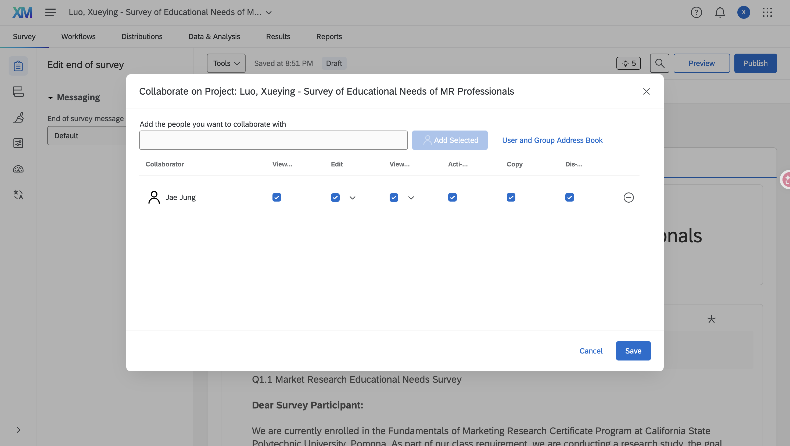
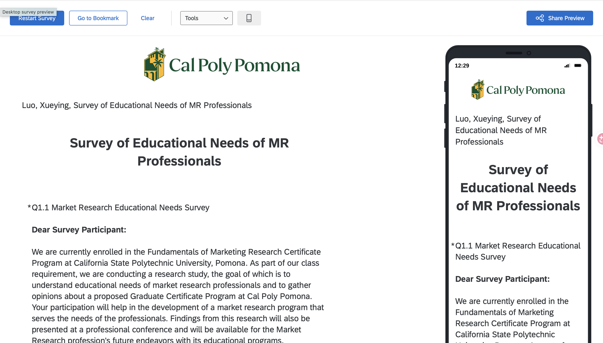
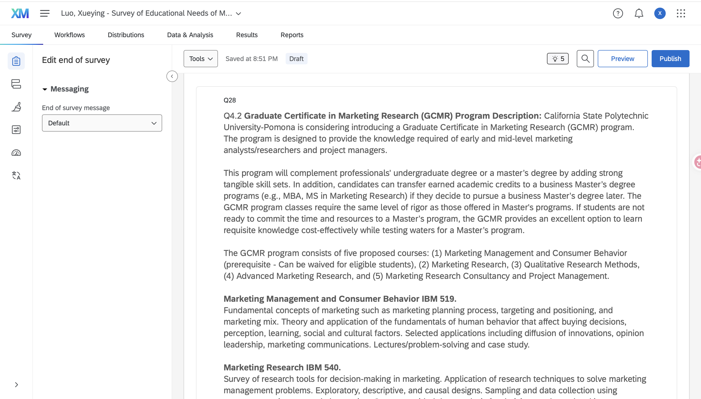
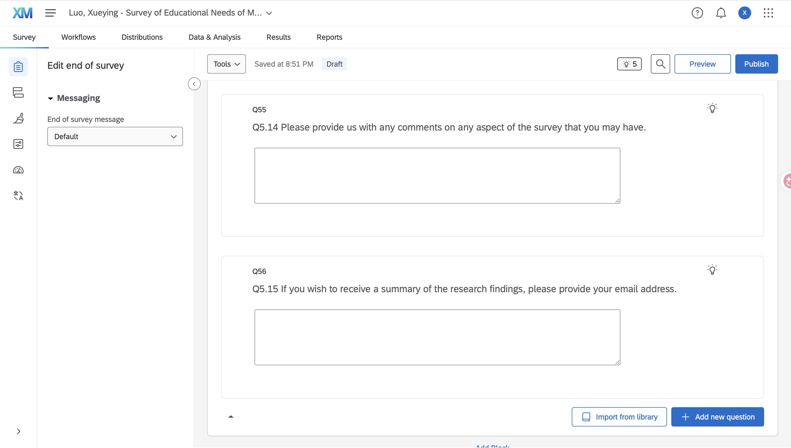

# Proof of Survey Sharing

The screenshot below shows that I shared my Qualtrics survey with Dr. Jae Jung and granted the required collaboration permissions.

# Beginning of Survey

The screenshot below shows the beginning of my Qualtrics survey.

# Middle of Survey

The screenshot below shows a middle section of my Qualtrics survey.

# Ending of Survey

The screenshot below shows the ending area of my Qualtrics survey.

# Appendix

## GitHub Repository

[View my GitHub Repository](https://github.com/Sheilaaa0312/Qualtrics-M01-1-Designing-Survey--Rough-draft---Sharing-Qualtrics-)

## GitHub Pages

[View my report on GitHub Pages](https://sheilaaa0312.github.io/Qualtrics-M01-1-Designing-Survey--Rough-draft---Sharing-Qualtrics-/)
